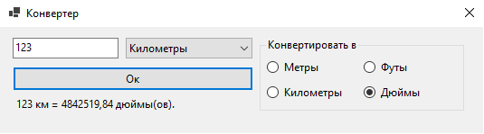

# meters_converter_cs

Эта программа была написана как решение простой лабораторной на C# с использованием WinForms. Программа переводит единицы измерения длины. 

Крайне простой интерфейс:



# Сборка

Собирается дотнетом:
```
$ dotnet build
```
Проект использует WinForms, потому сборка производится на windows.

Также можно открыть проект через Visual Studio и собрать.